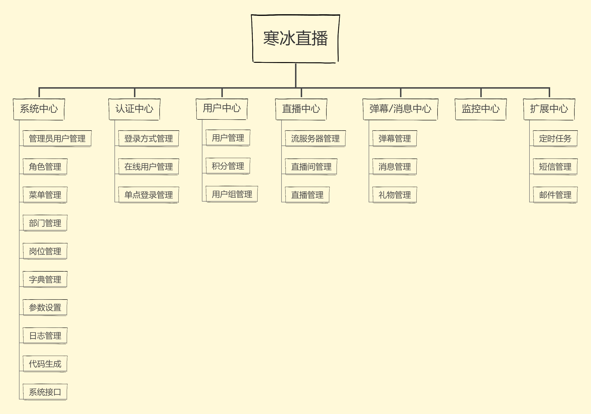
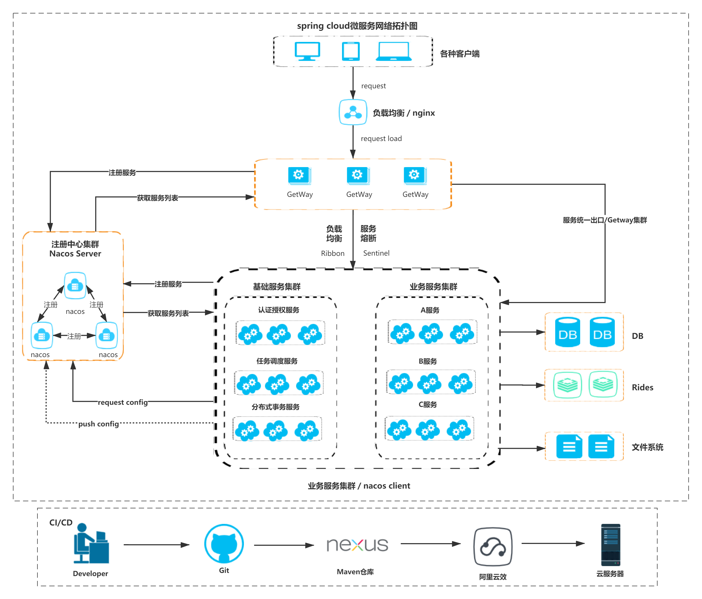

# ashe-live-ms（寒冰直播）

#### 1.介绍
***寒冰直播是一款基于OSSRS流服务器的直播平台。***
在此基础上开发了授权鉴权、直播间管理、直播管理等相关功能。项目整体采用微服务 和 前端后分离架构，为了方便操作将多个微服务放在了一个git项目下面，除此之外还包括两个前端项目分别是：
1. ashe-live（寒冰直播客户端项目） <https://gitee.com/oneplustow/ashe-live>
2. ashe-live-ui（寒冰直播后台管理项目）<https://gitee.com/oneplustow/ashe-live-ui>  
以上两个项目可以点击链接跳转到对应的git项目页面
#### 2.系统模块规划
寒冰直播将整体划分为七个模块中心，现阶段各模块中心规划图和进度如下  
* 系统中心：基本完成。功能持续扩展中（基于RuoYi二次开发）
* 认证中心：基本完成。功能持续扩展中
* 用户中心：可运行，整体功能还需完善和开发
* 直播中心：可运行，整体功能还需完善和开发
* 消息中心：规划中
* 监控中心：等待规划
* 扩展中心：规划中


#### 3.系统架构
##### 3.1系统架构说明
后端技术栈：
* 系统中心使用 [RuoYi](https://gitee.com/y_project/RuoYi-Vue) 为基础进行二次开发
* 使用目前流行的多种web技术，包括springboot springmvc、mybatis。
* Spring cloud Alibaba套件[Gateway，Nacos，Sentinel，OpenFegin、Ribbon]
* 其他工具包括 Mybatis-Plus Hutool easypoi mapstruct swagger3


##### 3.2系统架构图


##### 3.2目录结构
```markdown
ashe-live-ms  
├─ashe-live-business //业务中心
│    ├─auth-center  //认证中心
│    ├─live-center  //直播中心
│    ├─message-center  //消息中心
│    ├─system-center  //系统中心
│    └─user-center  //用户中心
├─ashe-live-common  //公共模块
│    ├─auth-center-api  //认证中心Fegin API
│    ├─common-code  //公共code
│    ├─common-web  //web公共代码
│    ├─system-center-api  //系统中心Fegin API
│    └─user-center-api  //用户中心Fegin API
├─ashe-live-config  //配置模块
│    ├─db-config  //数据库配置模块
│    ├─log-config  //日志配置模块
│    └─redis-config  //redis配置模块
├─ashe-live-gateway  //网关中心
├─deploy  //部署脚本
└─sql  //SQl脚本
```
##### 3.3业务中心结构
```markdown
src
 ├─main
 │    ├─java
 │    │  └─cn
 │    │    └─oneplustow
 │    │      └─xx
 │    │        ├─aspectj  //AOP切面代码
 │    │        ├─config  //配置代码
 │    │        ├─controller  //前端接口代码
 │    │        ├─entity  //数据库实体对象
 │    │        │  ├─criteria  //接口封装查询对象
 │    │        │  ├─dto  //接口封装保存对象
 │    │        │  └─vo  //接口返回对象
 │    │        ├─exception //各模块的异常类
 │    │        ├─mapper  //Mybatis Mapper接口
 │    │        │  └─xml  //Mbatis Mapper.xml 文件
 │    │        ├─open  //开放接口 提供给各模块之间 Feign调用
 │    │        ├─service  //服务接口类
 │    │        │  └─impl  //服务实现类
 │    │        └─util    //工具类
 │    └─resources
 │        ├─i18n   //国际化消息
```
#### 安装教程

#### 使用说明

#### 参与贡献

1.  Fork 本仓库
2.  新建 Feat_xxx 分支
3.  提交代码
4.  新建 Pull Request

#### 特技

