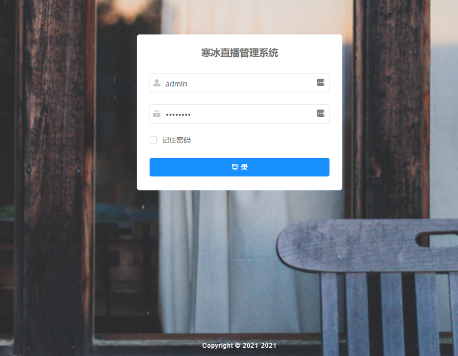

# ashe-live-ms（寒冰直播）
<span style="color: red;font-size: 12px;padding-top: -20px">
    注：现阶段仅供参考，还没到拿来就用的地步。请勿在启动上浪费太多时间！
</span>

<p align="center">
  
  
  
  
  
</p>


#### 1.介绍
***寒冰直播是一款基于OSSRS流服务器的直播平台。***
在此基础上开发了授权鉴权、直播间管理、直播管理等相关功能。项目整体采用微服务 和 前端后分离架构，为了方便操作将多个微服务放在了一个git项目下面，除此之外还包括两个前端项目分别是：  
[ashe-live（寒冰直播客户端前端项目）](https://gitee.com/oneplustow/ashe-live)
[ashe-live-ui（寒冰直播后台管理前端项目）](https://gitee.com/oneplustow/ashe-live-ui)

体验地址：
1. 寒冰直播：https://ashelive.oneplustow.cn --测试直播间：123 | 测试账号/密码：test/test 
2. 寒冰直播后台：https://ashelive.oneplustow.cn/ashe-live-ui -- 待开放
3. APM-skywalking：http://monitor.oneplustow.cn:9999
4. grafana：http://monitor.oneplustow.cn:3000 -- 用户名/密码：test/test
#### 2.系统模块规划
寒冰直播将整体划分为七个模块中心，现阶段各模块中心规划图和进度如下  
* 系统中心：基本完成。功能持续扩展中（基于RuoYi二次开发）
* 认证中心：基本完成。功能持续扩展中
* 用户中心：可运行，整体功能还需完善和开发
* 直播中心：可运行，整体功能还需完善和开发
* 消息中心：规划中
* 监控中心：等待规划
* 扩展中心：规划中


#### 3.系统架构
##### 3.1系统架构说明
后端技术栈：
* 系统中心使用 [RuoYi](https://gitee.com/y_project/RuoYi-Vue) 为基础进行二次开发
* 使用目前流行的多种web技术，包括springboot springmvc、mybatis。
* Spring cloud Alibaba套件[Gateway，Nacos，Sentinel，OpenFegin、Ribbon]
* 其他工具包括 Mybatis-Plus Hutool easypoi mapstruct swagger3


##### 3.2系统架构图


##### 3.2目录结构
```markdown
ashe-live-ms  
├─ashe-live-business      //业务中心
│    ├─auth-center        //认证中心
│    ├─live-center        //直播中心
│    ├─message-center     //消息中心
│    ├─system-center      //系统中心
│    └─user-center        //用户中心
├─ashe-live-common        //公共模块
│    ├─auth-center-api    //认证中心Fegin API
│    ├─common-code        //公共code
│    ├─common-web         //web公共代码
│    ├─system-center-api  //系统中心Fegin API
│    └─user-center-api    //用户中心Fegin API
├─ashe-live-config        //配置模块
│    ├─db-config          //数据库配置模块
│    ├─log-config         //日志配置模块
│    └─redis-config       //redis配置模块
├─ashe-live-gateway       //网关中心
├─deploy                  //部署脚本
└─sql                     //SQl脚本
```
##### 3.3业务中心结构
```markdown
src
 ├─main
 │   ├─java
 │   │ └─cn
 │   │  └─oneplustow
 │   │   └─xx
 │   │    ├─aspectj          //AOP切面代码
 │   │    ├─config           //配置代码
 │   │    ├─controller       //前端接口代码
 │   │    ├─entity           //数据库实体对象
 │   │    │  ├─criteria      //接口封装查询对象
 │   │    │  ├─dto           //接口封装保存对象
 │   │    │  └─vo            //接口返回对象
 │   │    ├─exception        //各模块的异常类
 │   │    ├─mapper           //Mybatis Mapper接口
 │   │    │  └─xml           //Mbatis Mapper.xml 文件
 │   │    ├─open             //开放接口 提供给各模块之间 Feign调用
 │   │    ├─service          //服务接口类
 │   │    │  └─impl          //服务实现类
 │   │    └─util             //工具类
 │   └─resources
 │       ├─i18n   //国际化消息
```
#### 4.系统功能界面图
<center>(寒冰直播客户端登录界面)&nbsp;&nbsp;↓</center>


<center>(寒冰直播客户端主界面)&nbsp;&nbsp;↓</center>


<center>(寒冰直播客户端播放界面)&nbsp;&nbsp;↓</center>


<center>(寒冰直播后台登录界面)&nbsp;&nbsp;↓</center>



<center>(寒冰直播后台用户管理)&nbsp;&nbsp;↓</center>


<center>(寒冰直播后台流服务器管理)&nbsp;&nbsp;↓</center>


<center>(监控系统-APM-skywalking)&nbsp;&nbsp;↓</center>


<center>(监控系统-APM-skywalking)&nbsp;&nbsp;↓</center>


<center>(监控系统-prometheus-grafana)&nbsp;&nbsp;↓</center>


#### 安装教程

#### 使用说明
观看直播：
1. 进入到寒冰直播页面 
2. 点击观看直播
3. 输入直播间房间号即可观看直播（测试房间号：123）

推流直播：
1. 推流需要先注册用户
2. 点击"我要直播"
3. 输入自己的直播间名称点击"开通"
4. 开通后"我要直播"会变成“我的直播间”
5. 点击“我的直播间”里面的”开始直播“获取推流地址和密码
6. 使用推流软件如OBS进行推流即可
7. 观看直播参考上面的流程

## 鸣谢

- 感谢 JetBrains 提供的免费开源 License：
<p align="left">
    <a target="_blank" href="https://www.jetbrains.com/?from=ashe-livey">
        
    </a>
</p>


#### 问题及解决记录
*  [Feign整合Sentinel后进行下游系统的错误处理](https://b95ed8.baklib-free.com/6296/536a)
*  [基于jasypt原理开发符合项目的配置加密框架]()
#### 参与贡献

1.  Fork 本仓库
2.  新建 Feat_xxx 分支
3.  提交代码
4.  新建 Pull Request

#### 特技

